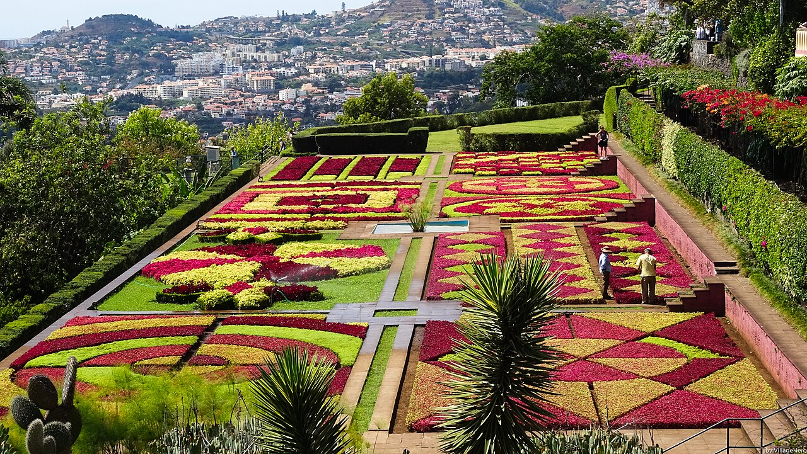
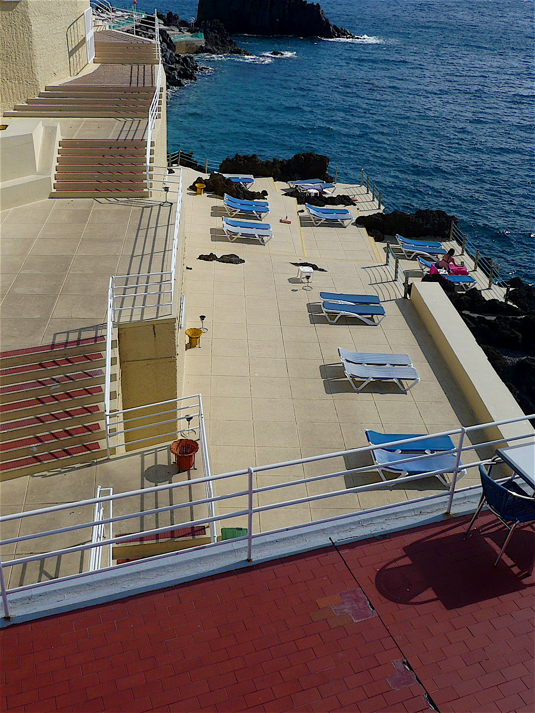
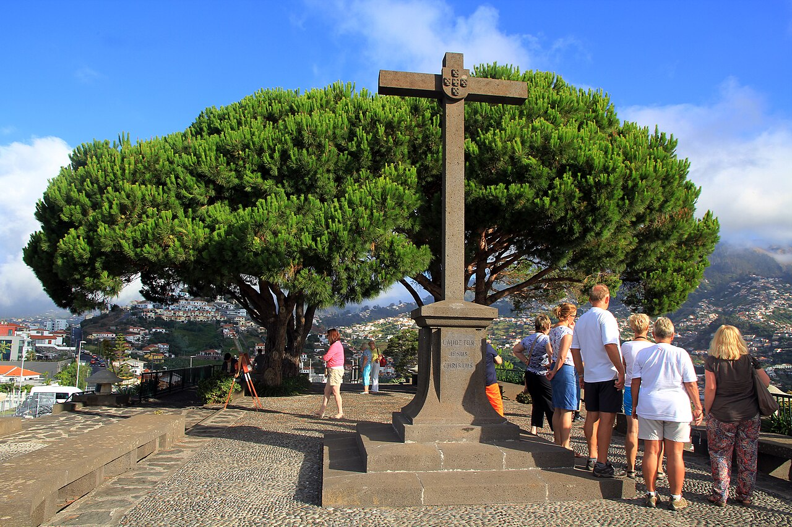
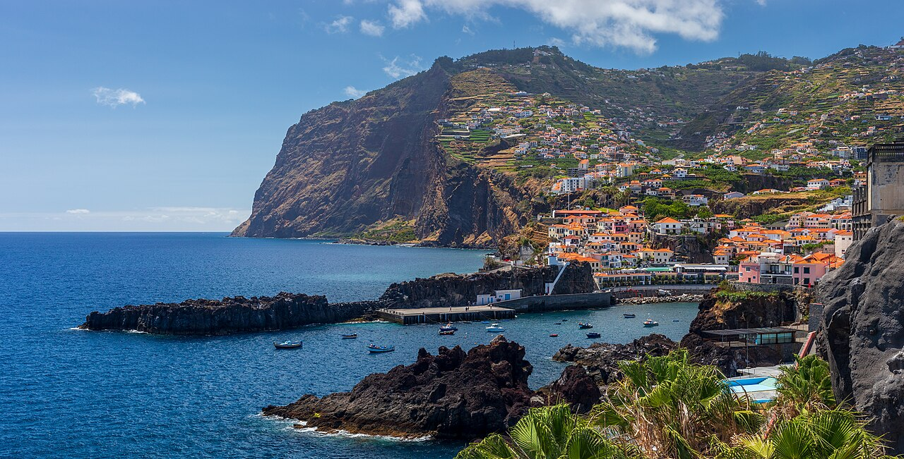
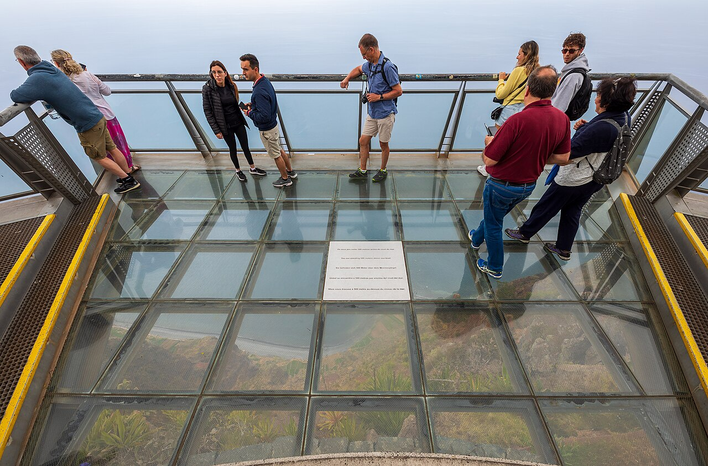

# Dimanche 6 — deux itinéraires (avant le check-in)

Arrivée, **peu de sommeil**, **voiture**. Check-in Magnolia ~**15:00** ([Beco da Quinta da Fe 24](https://maps.google.com/?q=Beco+da+Quinta+da+Fe+24+Funchal)). Pas de sentier. Mercado **fermé**.

Les deux journées finissent pareil : [Pingo Doce Lido](https://maps.google.com/?q=Pingo+Doce+Rua+do+Gorgulho+Funchal) → clés → sieste → dîner Estrada Monumental.

Photos : Wikimedia Commons (crédits sous chaque image).

---

## Itinéraire A — Jardim Botânico

Jardin le matin, mer l’après-midi. **Un seul jardin** — pas [Monte Palace](https://montepalacemadeira.com/en/visit/).

*Jardim Botânico da Madeira — VillageHero, [CC BY 2.0](https://creativecommons.org/licenses/by/2.0/), via [Wikimedia](https://commons.wikimedia.org/wiki/File:Jardim_Botanico_2_(Funchal)_(37389127434).jpg).*

### Étapes

| Heure | Quoi | Liens |
| --- | --- | --- |
| **9:00** | Café Lido / Estrada Monumental | [Passeio Marítimo](https://www.visitmadeira.com/pt/o-que-fazer/viver-a-cidade-do-funchal/explorar-a-cidade/passeios-publicos/passeio-maritimo-do-funchal/) |
| **9:30–12:00** | **Jardim Botânico** — €10/pers., 9h–18h (dernière entrée 17h30), parking sur place. ~2 h. Sortir **avant 12h15** | [Infos IFCN](https://ifcn.madeira.gov.pt/en/quintas-e-jardins/jardin-botanico-da-madeira-eng-rui-vieira/informacao-ao-visitante.html) · [Visit Madeira](https://visitmadeira.com/pt/o-que-fazer/viver-a-cidade-do-funchal/explorar-a-cidade/miradouros-no-funchal/miradouro-do-jardim-botanico/) · [Carte](https://maps.google.com/?q=Jardim+Botânico+da+Madeira+Caminho+do+Meio) |
| **12:15–13:15** | Déjeuner près du jardin ou redescendre au Lido | — |
| **13:30–14:30** | Courses + 20 min **Lido → Ponta da Cruz** si jambes OK | [Pingo Doce](https://maps.google.com/?q=Pingo+Doce+Rua+do+Gorgulho+Funchal) · [Ponta da Cruz](https://maps.google.com/?q=Ponta+da+Cruz+Funchal) |
| **15:00** | Check-in Magnolia, douche, sieste 45–90 min | [Carte hôtel](https://maps.google.com/?q=Beco+da+Quinta+da+Fe+24+Funchal) · [Booking](https://www.booking.com/hotel/pt/magnolia-residence.fr.html) |
| **Soir** | Dîner Estrada Monumental, coucher tôt | — |

*Complexo Balnear do Lido — Ulrika, [CC BY 2.0](https://creativecommons.org/licenses/by/2.0/), via [Wikimedia](https://commons.wikimedia.org/wiki/File:Lido,_Funchal_2.jpg).*

**Si le jardin fatigue :** coupez après 1 h, descendez à [Praia Formosa](https://maps.google.com/?q=Praia+Formosa+Funchal), asseyez-vous.

**Skip :** Monte Palace (€18), téléphérique, luge.

---

## Itinéraire B — Côte ouest (sans jardin)

Vues + village + skywalk. Moins de pentes que le Botânico.

### 1. Pico dos Barcelos — 9:30–10:00

*Pico dos Barcelos — Karelj, [CC BY-SA 4.0](https://creativecommons.org/licenses/by-sa/4.0/), via [Wikimedia](https://commons.wikimedia.org/wiki/File:Madeira_Pico_dos_Barcelos_2016_1.jpg).*

5–10 min du Magnolia. **Gratuit**, parking. 15 min sur place.

- [Visit Madeira](https://visitmadeira.com/pt/o-que-fazer/viver-a-cidade-do-funchal/explorar-a-cidade/miradouros-no-funchal/miradouro-do-pico-dos-barcelos/)
- [Carte](https://maps.google.com/?q=Pico+dos+Barcelos+Funchal)

### 2. Câmara de Lobos — 10:15–11:15

*Câmara de Lobos depuis le Salão Ideal — Ximonic, [CC BY-SA 4.0](https://creativecommons.org/licenses/by-sa/4.0/), via [Wikimedia](https://commons.wikimedia.org/wiki/File:View_from_Miradouro_do_Salão_Ideal_in_Câmara_de_Lobos,_Madeira,_2023_May.jpg).*

~15 min vers l’ouest. Port, quais, xavelhas. Marche plate.

- [Visit Madeira — Câmara](https://visitmadeira.com/en/where-to-go/madeira/south-coast/camara-de-lobos/)
- [Promenade](https://visitmadeira.com/en/where-to-go/madeira/south-coast/camara-de-lobos/camara-de-lobos-promenade/)
- [Carte du port](https://maps.google.com/?q=Porto+de+Câmara+de+Lobos)

### 3. Cabo Girão — 11:30–12:15

*Skywalk Cabo Girão — Ximonic, [CC BY-SA 4.0](https://creativecommons.org/licenses/by-sa/4.0/), via [Wikimedia](https://commons.wikimedia.org/wiki/File:Glass_balcony_of_Cabo_Girão_skywalk,_Câmara_de_Lobos,_Madeira,_2023_May.jpg).*

Encore ~15 min en montée. **€5**/pers. sur place, **8h–20h**, pas de créneau. 20–30 min. Parking plus simple avant midi.

- [Visit Madeira](https://visitmadeira.com/en/where-to-go/madeira/south-coast/camara-de-lobos/cabo-girao/)
- [Billet SIMplifica](https://simplifica.madeira.gov.pt/services/78-79-256) (facultatif — kiosques sur place)
- [Carte](https://maps.google.com/?q=Cabo+Girão+Skywalk)

### Suite de la journée

| Heure | Quoi |
| --- | --- |
| **12:30–13:30** | Déjeuner à Câmara (poisson / espetada) |
| **13:45–14:30** | Retour Lido → [Pingo Doce](https://maps.google.com/?q=Pingo+Doce+Rua+do+Gorgulho+Funchal) |
| **15:00** | [Check-in Magnolia](https://maps.google.com/?q=Beco+da+Quinta+da+Fe+24+Funchal), douche, sieste |
| **Soir** | Dîner Lido. 15 min [Ponta da Cruz](https://maps.google.com/?q=Ponta+da+Cruz+Funchal) seulement si vous tenez encore |

**Si tapés après Barcelos :** skip Girão, restez Câmara + [Formosa](https://maps.google.com/?q=Praia+Formosa+Funchal).

---

## Comment choisir

| | A Botânico | B Côte |
| --- | --- | --- |
| Ambiance | Plantes, terrasses, calme | Mer, village, falaise |
| Marche | Pentes ~2 h | Surtout assis / plat |
| Coût | €20 (2 pers.) | €10 (Girão) |
| Voiture | Un parking | 3 arrêts |

**A** si vous voulez un truc « visité » et garder Girão pour jeudi.  
**B** si vous voulez de l’air après l’avion.

Sacs au coffre, rien de visible. Message à l’hôte pour déposer les sacs avant 15h.

Retour : [funchal.md](funchal.md).
